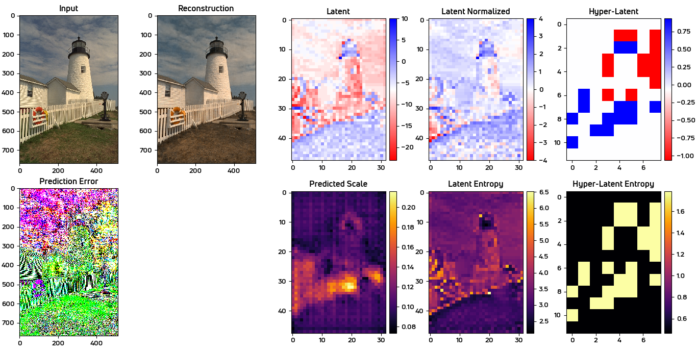
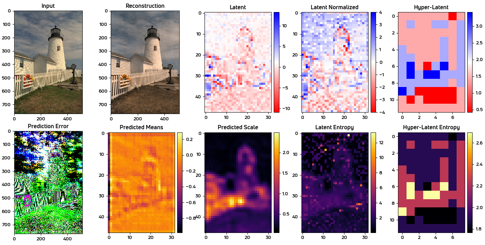
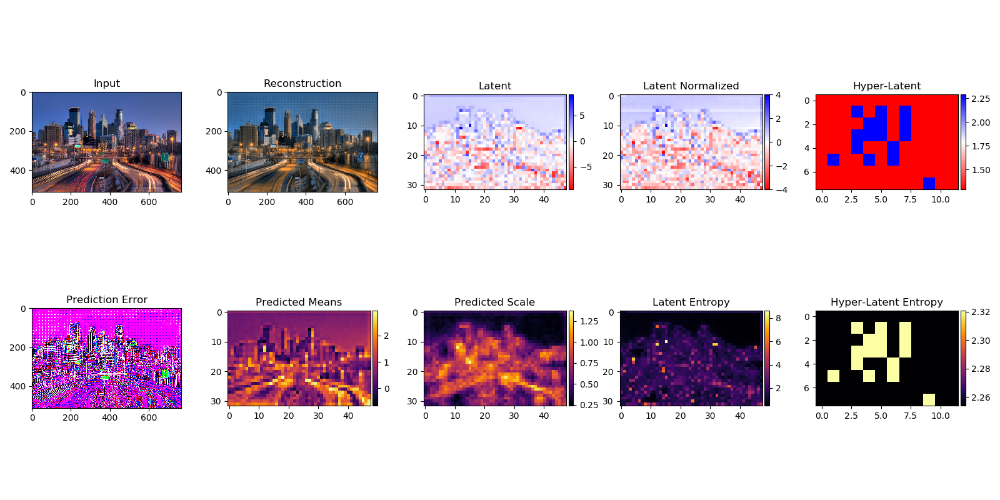
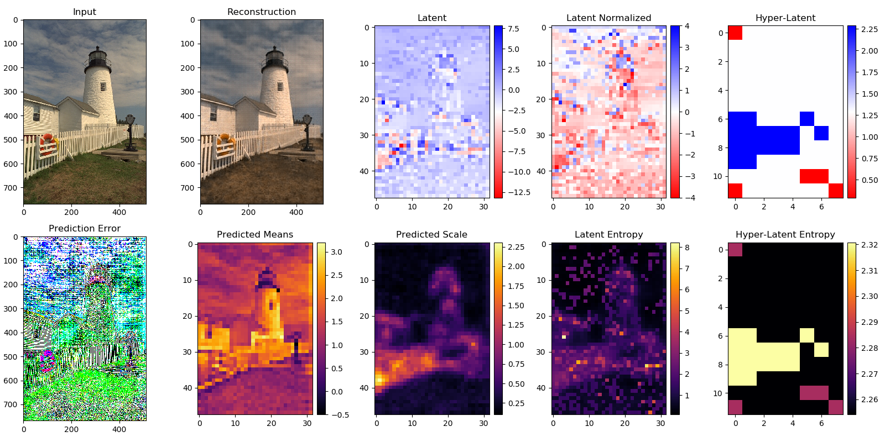

# advDNIC.estimator

#### Experiments done in May 2019

#### Training

##### Base Model

- Training on CLIC 2019
```bash
$ python main.py --verbose --model-dir="experiments/base_model/generator" train \
                  --train-data-dir="data/train" \
                  --eval-data-dir="data/benchmark/kodak" \
                  --num-parallel-calls=4 \
                  --batchsize=4 \
                  --epochs=1000 \
                  --save-summary-steps=10 \
                  --random-seed=230 \
                  --allow-growth=True \
                  --xla=False \
                  --save-profiling-steps=0 \
                  --log-verbosity="INFO"
```

- Compress using model trained on CLIC 2019
```bash
$ python main.py --verbose --model-dir="experiments/base_model/generator" compress overfit.png
```

- Decompress using model trained on CLIC 2019
```bash
$ python main.py --verbose --model-dir="experiments/base_model/generator" decompress overfit.png.ncf
```
- Benchmark
```bash
$ python main.py --verbose --model-dir="experiments/base_model/generator" benchmark --allow-growth=False
```

## Results on CLIC2019 dataset

#### Base

> #### scale based hyperprior
>   - ##### (model training step 1136)
> 

> #### mean and scale based hyperprior
> - ##### (model training step 3108)
> 

> #### joint autoregressive and hierarchical prior (pixelCNN)
> - ##### (model training step 8640)
> 

> #### joint autoregressive and hierarchical prior (fast-pixelCNN++)
> - ##### (model training step 8640)
> 


Note that the learned model was not adapted in any way for evaluation on this image.

#### Look at the results folder for running configs for below experiments

## Experiments

  ### Analysis and Synthesis Transform Modifications

#### base
- Contains code to replicate

    > J. Ballé, D. Minnen, S. Singh, S.J. Hwang, N. Johnston:<br />
    > "Variational Image Compression with a Scale Hyperprior"<br />
    > Int. Conf. on Learning Representations (ICLR), 2018<br />
    > https://arxiv.org/abs/1802.01436

#### mod1
- Same as the above base model
- Modifications :
    1. Mobile-Bottleneck Residual Convolutional Layer (EfficientNetV1)

#### mod2
- Similar to mod1
- Modifications :
    1. EfficientNetV1 like architecture for downsampling and its inverse for upsampling using SignalConv Blocks for down/up-sampling and GDN/IGDN for activations.

#### mod3
- Similar to mod2
- Modifications :
    1. EfficientNetV1 like architecture for downsampling and its inverse for upsampling using basic using basic Conv-Batch-Relu layers
    for downsampling and ICNR_Subpixel-Batch-Relu for upsampling.

#### mod4
- same as mod3 but no EfficientNetV1 architecture.

### Overall Model modifications

#### variant1
- same as mod3, but uses only scale based hyperprior, similar to

  > "Variational Image Compression with a Scale Hyperprior"<br />
  > Int. Conf. on Learning Representations (ICLR), 2018<br />
  > https://arxiv.org/abs/1802.01436

#### base (this is the basic generator transform)
- Contains the base architecture from the paper

  > David Minnen, Johannes Ballé, George Toderici:<br />
  > "Joint Autoregressive and Hierarchical Priors for Learned Image Compression"<br />
  > https://arxiv.org/abs/1809.02736v1

#### variant2
- same as base, but uses both mean and scale based hyperprior, but no autoregressive prior in hierarchy.

#### variant3
- same as base, but uses both mean and scale based hyperprior, and uses a fast variant of pixelCNN++ autoregressive prior in hierarchy.

#### variant3_old
- old version of variant3 using simple basic pixelCNN from OpenAI.

#### variant4
- same as variant3, but transforms are modified to architecture similar to
  with added Non-Local Block, Non-Local Attention Feature Extraction Module (NLAM), Mish & GDN combo activations, Subpixel upsampling (ICNR init).

  > XiangJi Wu, Ziwen Zhang, Jie Feng, Lei Zhou, Junmin Wu<br />
  > "End-to-end Optimized Video Compression with MV-Residual Prediction"<br />
  > https://openaccess.thecvf.com/content_CVPRW_2020/papers/w7/Wu_End-to-End_Optimized_Video_Compression_With_MV-Residual_Prediction_CVPRW_2020_paper.pdf


## Citation

```
@article{Ball2017EndtoendOI,
  title={End-to-end Optimized Image Compression},
  author={Johannes Ball{\'e} and Valero Laparra and Eero P. Simoncelli},
  journal={ArXiv},
  year={2017},
  volume={abs/1611.01704}
}
```
```
@article{Ball2018EfficientNT,
  title={Efficient Nonlinear Transforms for Lossy Image Compression},
  author={Johannes Ball{\'e}},
  journal={2018 Picture Coding Symposium (PCS)},
  year={2018},
  pages={248-252}
}
```
```
@article{Ball2018VariationalIC,
  title={Variational image compression with a scale hyperprior},
  author={Johannes Ball{\'e} and David C. Minnen and Saurabh Singh and Sung Jin Hwang and Nick Johnston},
  journal={ArXiv},
  year={2018},
  volume={abs/1802.01436}
}
```
```
@article{Minnen2018JointAA,
  title={Joint Autoregressive and Hierarchical Priors for Learned Image Compression},
  author={David C. Minnen and Johannes Ball{\'e} and George Toderici},
  journal={ArXiv},
  year={2018},
  volume={abs/1809.02736}
}
```
```
@article{Wu2020EndtoendOV,
  title={End-to-end Optimized Video Compression with MV-Residual Prediction},
  author={Xiangjian Wu and Ziwen Zhang and Jie Feng and Lei Zhou and Jun-min Wu},
  journal={2020 IEEE/CVF Conference on Computer Vision and Pattern Recognition Workshops (CVPRW)},
  year={2020},
  pages={611-614}
}
```
```
@article{Oord2016ConditionalIG,
  title={Conditional Image Generation with PixelCNN Decoders},
  author={A{\"a}ron van den Oord and Nal Kalchbrenner and Lasse Espeholt and Koray Kavukcuoglu and Oriol Vinyals and Alex Graves},
  journal={ArXiv},
  year={2016},
  volume={abs/1606.05328}
}
```

```
@article{Salimans2017PixelCNNIT,
  title={PixelCNN++: Improving the PixelCNN with Discretized Logistic Mixture Likelihood and Other Modifications},
  author={Tim Salimans and Andrej Karpathy and Xi Chen and Diederik P. Kingma},
  journal={ArXiv},
  year={2017},
  volume={abs/1701.05517}
}
```

```
@article{Chen2018PixelSNAILAI,
  title={PixelSNAIL: An Improved Autoregressive Generative Model},
  author={Xi Chen and Nikhil Mishra and Mostafa Rohaninejad and P. Abbeel},
  journal={ArXiv},
  year={2018},
  volume={abs/1712.09763}
}
```

```
@article{Wang2018NonlocalNN,
  title={Non-local Neural Networks},
  author={X. Wang and Ross B. Girshick and Abhinav Kumar Gupta and Kaiming He},
  journal={2018 IEEE/CVF Conference on Computer Vision and Pattern Recognition},
  year={2018},
  pages={7794-7803}
}
```

```
@article{Zhang2019ResidualNA,
  title={Residual Non-local Attention Networks for Image Restoration},
  author={Yulun Zhang and Kunpeng Li and Kai Li and Bineng Zhong and Yun Raymond Fu},
  journal={ArXiv},
  year={2019},
  volume={abs/1903.10082}
}
```
```
@inproceedings{Misra2020MishAS,
  title={Mish: A Self Regularized Non-Monotonic Activation Function},
  author={Diganta Misra},
  booktitle={BMVC},
  year={2020}
}
```


If you use this library for research purposes, please cite:
```
@software{tfc_github,
  author = "Ballé, Johannes and Hwang, Sung Jin and Johnston, Nick",
  title = "{T}ensor{F}low {C}ompression: Learned Data Compression",
  url = "http://github.com/tensorflow/compression",
  version = "1.2",
  year = "2019",
}
```
In the above BibTeX entry, names are top contributors sorted by number of
commits. Please adjust version number and year according to the version that was
actually used.

